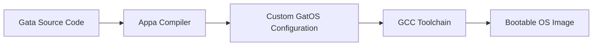

# GatOS: A Versatile, Modular Kernel for Toy-OS Builds

[](https://github.com/ApparentlyPlus/GatOS/actions/workflows/kernel.yml)
[](#license)

GatOS is a cleanly designed, modular kernel serving as the foundational layer for building toy operating systems. It is also part of my undergraduate thesis at the [University of Macedonia](https://www.uom.gr/en/dai), and serves as the backbone of a configurable, toy-OS building toolchain called PawStack.

> [!NOTE]
> This project is currently under active development and is not yet ready for production use or general local deployment.

The first section of this README focuses on providing some insight as to the vision of this project. If you're just interested in running GatOS in your system, skip to the [Getting Started](#getting-started) section.


## Table of Contents

- [Project Overview & Background](#project-overview--background)
- [Getting Started](#getting-started)
- [Testing](#testing)
- [Development](#development)
- [Documentation](#documentation)
- [Contributing](#contributing)
- [License](#license)
- [Acknowledgments](#acknowledgments)


## Project Overview & Background

### What is PawStack?

"PawStack" is just the name I decided to use for a development toolchain that aims to drastically simplify OS development. It allows you to write code just like you would for a regular program — but instead of compiling to an application, your code is compiled directly into a complete, bootable operating system image.

This means your program ***is*** the operating system.

PawStack handles the complex parts of turning your code into low-level machine instructions that run on real hardware or emulators. The goal is to let you focus on building your OS's features without worrying about the usual technical challenges involved in OS development.

The whole toolchain is comprised of 3 components:

| Component | Description | Status |
|-----------|-------------|--------|
| **GatOS** | The current project. It is a modular kernel forming the core of PawStack. It aims to expose APIs and syscalls for core OS functionality. | **In Development** |
| **Gata** | A custom high-level programming language for writing operating systems. It will *feel* like a modern language but will be built with features that make low-level development simpler and more approachable. | **Planned** |
| **Appa** | The compiler for Gata. It takes in Gata source code and transpiles it into C code that calls GatOS's APIs. Appa constructs the kernel depending on the code's logic by leveraging the modularity of GatOS's design. The end result is a custom-configured version of GatOS for that specific Gata project. | **Planned** |


Technically, GatOS is not the end of the toolchain. Even after you have a version of GatOS generated for your Gata logic, the kernel itself still needs to be compiled into bare-metal machine code. This final build stage is handled by a GCC-based compilation toolchain, with packaging done through tools like grub-mkrescue and xorriso to produce a bootable image.

### Build Pipeline



> [!TIP]
> Currently, GatOS is the only project under development - with Gata and Appa to follow in a different Github repository once GatOS core is done.

> [!WARNING]
> It should also be noted that GatOS does not include its own bootloader, relying instead on GRUB for loading.

### What's with these names?

Glad you asked! Here's the story behind them:

**GatOS** is a playful pun on the Greek word *gatos* (meaning "male cat"), with the "OS" tacked on for "Operating System". It was inspired by a similar, more educationally focused project called [Skyl-OS](https://github.com/Billyzeim/Skyl-OS) — another pun, this time on *skylos* (meaning "male dog") — created by a close friend of mine. 

> [!TIP]
> If you're interested in learning OS development, I highly recommend checking out his work! His kernel is designed with teaching in mind (beginner to advanced concepts), while mine focuses more on optimizations, clean code, and modularity.

Following the same "cat" theme, I named the high-level language of the toolchain "**Gata**" — Greek for "female cat." It felt like the perfect fit for the language developers will use to interact with the toolchain, write code, and build their projects.

Finally, the compiler in the toolchain is called **Appa**. The name is inspired from the flying bison in Nickelodeon's animated series *"Avatar: The Last Airbender"*, a loyal companion to the main cast. The "bison" part is intentional — it's a direct nod to [GNU Bison](https://github.com/akimd/bison), the well-known syntax analysis tool used in building compilers.

"**PawStack**" is just a blend of comp-sci lingo and the animal based naming convention — perfect name for describing the entire toolchain ;)

### What is your university thesis on?

In short, my thesis focuses on developing a functional demo of the PawStack toolchain and thoroughly documenting its inner workings.

When I began, I had zero prior experience in OS development. Because of that, I see this as a great opportunity not only to deliver the demo, but also to create concise write-ups detailing my journey — what steps I took, the mistakes I made, what I omitted, what could be improved, and the features I implemented.

The end goal is for this to serve as a helpful reference in a field where accessible, beginner-friendly resources are scarce.

### Are you crazy?

Yes, absolutely. Name **one** other person who's trying to finish a 4-year degree in 3 years *while* building an entire operating system toolchain as their thesis.

This is either a feat of legendary ambition or an elaborate self-inflicted stress experiment. Possibly both.

## Getting Started

> [!IMPORTANT]
> This project is a work in progress and building is not seamless yet. The project is not ready to be run locally in general, but if you're feeling adventurous and have the right setup, you can give it a shot.

These instructions will get you a copy of the project up and running on your local machine for development and testing purposes.

### Prerequisites

Currently supported systems:
- **Ubuntu/Debian Linux** (including WSL)
- Systems with `apt` package manager

If you have `apt` as your package manager and run on Ubuntu or Debian in Linux or WSL, you should be able to just run the setup script for prerequisites.

### Quick Start (Ubuntu/Debian)

```bash
# Install prerequisites
./setup.sh

# Restart your terminal!

# Run the kernel in QEMU
./run.sh
```

> [!NOTE]
> These scripts are for development purposes. The system may not work as expected, and features are subject to change as the project evolves.

## Testing

Currently, there is no formal testing suite built into the project. We're working with a more... let's call it "primitive" approach.

### Current Testing Approach

The testing is done through runtime debugging and manual verification:

- **Debug Output**: We use the `DEBUG(string, TOTAL_DBG)` function in C to output messages to QEMU's serial console
- **Manual Verification**: Check the QEMU serial output to see if we've hit specific points in the code
- **GitHub Actions**: There's a workflow that checks the QEMU serial output for basic functionality validation

It's not pretty, but it works for now while the core functionality is being developed.

### Running Tests

Since there's no automated test suite, "testing" means running the kernel and checking if your debug messages appear:

```c
#include "debug.h"
#define TOTAL_DBG 2

void my_function() {
    DEBUG("Made it to my_function - things are working!", TOTAL_DBG);

    // Your code here

    DEBUG("Still alive after doing stuff", TOTAL_DBG);
}
```

Then run `./run.sh` and watch the serial output to see if your messages appear.

## Development

### Development Workflow

The development process follows a pretty standard Git workflow:

1. **Feature Branches**: New features are developed in separate branches
2. **Manual Testing**: Test your changes using the debug output approach
3. **CI Validation**: GitHub Actions runs automated checks on the QEMU serial output
4. **Merge**: Successfully tested branches get merged back to main

### Debugging

The main debugging tool is the `DEBUG()` function. It's your best friend for figuring out what's happening (or not happening) in the kernel:

```c
DEBUG("Kernel booting...", TOTAL_DBG);
// ... some code ...
DEBUG("Memory manager initialized", TOTAL_DBG);
// ... more code ...
DEBUG("Ready to handle interrupts", TOTAL_DBG);
```

## Documentation

Some documentation and writeups are available in the [`docs/`](./docs/) folder, though this is not the focus of the project. This includes development notes, architecture decisions, learning resources, and basically everything I've figured out (or struggled with) during this journey.

Again, a reminder that [Skyl-OS](https://github.com/Billyzeim/Skyl-OS) is a much better resource for beginners!

## Contributing

Contributions are not open since this is my thesis and thus must be my work alone. I need to be able to demonstrate that I understand every piece of code in this project, which means I have to write it myself.

However, you can still:
- **Report Issues**: If you find bugs or have questions, feel free to open issues
- **Provide Feedback**: Suggestions and feedback are always welcome through issues
- **Follow Along**: Watch the repository if you're interested in seeing how this progresses

Once the thesis is complete, I might consider opening it up for contributions, but that's a decision for future me.


## License

This project is licensed under a strict custom license that does not allow for replication of the code without explicit consent. I am unsure how this project will be used in the future, so the licensing is restrictive for now.

See the [LICENSE.md](LICENSE.md) file for details.

The restrictive nature is partly due to academic requirements and partly because I haven't decided what I want to do with this project long-term. This may change after thesis completion.

## Acknowledgments

- [Skyl-OS](https://github.com/Billyzeim/Skyl-OS) - A fantastic educational OS project from my dear friend, u/Billyzeim
- [The OS-Dev Wiki](https://wiki.osdev.org/Expanded_Main_Page) - The best starting place for OS development, with plenty of information on how to start.
- [MittOS64](https://github.com/thomasloven/mittos64) - Very good documentation that helped me through a lot of the struggles so far
- [Simple-OS](https://github.com/httpe/simple-os) - An already self-hosted modern kernel with libc ported, plenty useful for peeking inside implementations
- [OS-Series](https://github.com/davidcallanan/os-series/) - Helped me boostrap the entire project